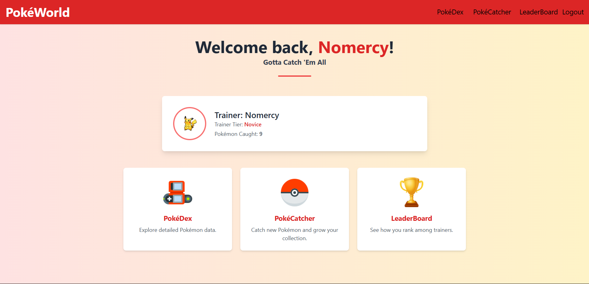
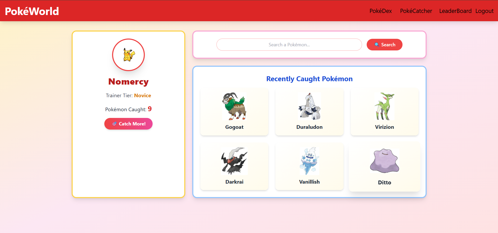
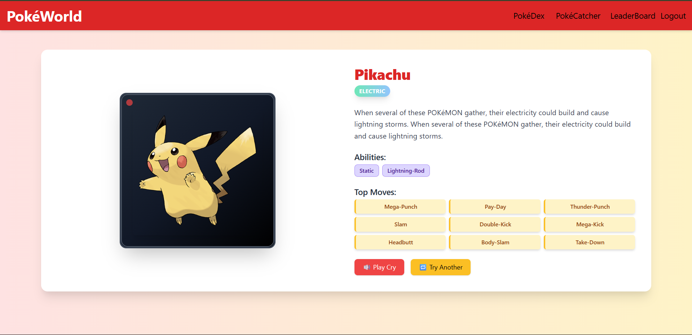
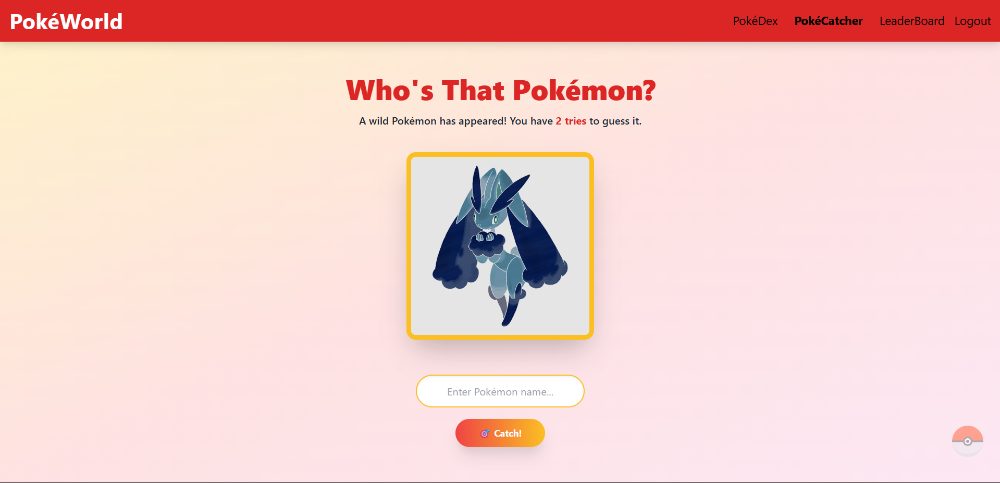
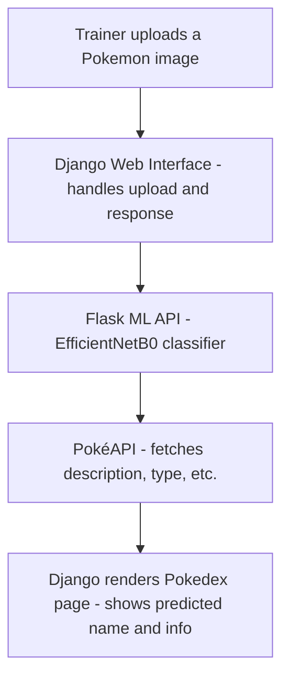
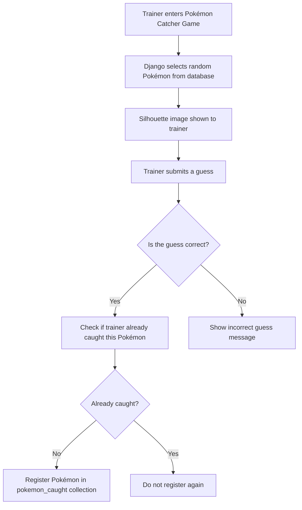

# PokéWorld

A full-stack Pokémon web application where trainers can **classify a Pokémon image**, **explore its details**, and **catch Pokémon**!  
**Django** powers the core web interface and game logic, while a **Flask-based REST API** runs a fine-tuned **CNN model** to classify uploaded Pokémon images.  
The predicted Pokémon's information is then fetched live from the [PokéAPI](https://pokeapi.co) to simulate a Pokédex experience.


## 🔥 Features

- 🧠 **Flask ML API** – A separate Flask service that exposes a REST endpoint to classify Pokémon images using a trained TensorFlow CNN model (`EfficientNetB0`).
- 🧾 **Pokédex via Classification** – Upload a Pokémon image to classify it using the CNN model, then fetch detailed information (description, types, moves, sounds) about the predicted Pokémon from [PokéAPI](https://pokeapi.co).
- 🎮 **PokeCatcher** – Guess the Pokémon from its silhouette and catch it to build your collection.
- 📦 **MongoDB Integration** – Stores information about trainers, available Pokémon, and the Pokémon caught by each trainer.
- 🏆 **Leaderboard System** – Displays rankings of:
  - Trainers based on the total number of Pokémon they’ve caught.
  - Pokémon based on how frequently they’ve been caught across all trainers.


## 📸 Screenshots

Here are some snapshots of key features and pages in the PokeWorld application:

---

### 🏠 Landing Page
A welcoming homepage where users explore core features like the Pokédex and Catcher game.



---

### 👤 Profile Page
Displays trainer-specific details such as the total number of Pokémon caught and their collection.



---

### 🧾 Pokédex Page
Shows detailed information about a classified Pokémon using data from the PokéAPI.



---

### 🎮 Pokémon Catcher Game
Interactive guessing game where the trainer tries to identify Pokémon by their silhouette.



---


## 🧱 Architecture Overview

This section outlines the complete architecture for the **Pokédex** and **Pokémon Catcher** features, including how the CNN model, PokéAPI, and MongoDB are used.

---

### 📖 Pokédex via Image Classification



- **Flask ML API**: Receives image → Predicts Pokémon name.
- **Django Backend**: Sends image to Flask → Receives prediction → Fetches info from PokéAPI → Displays result.
- **PokéAPI**: Supplies Pokémon descriptions, moves, sounds, types.


### 🎮 Pokémon Catcher Game




- **Pokémon Selection**: Randomly chosen from `pokemons` collection.
- **Uniqueness Check**: A Pokémon is registered only once per trainer (first catch only).
- **Silhouette Display**: Only shows the silhouette, not the full image.
- **Guess Validation**: Case-insensitive comparison to Pokémon name.

---

### 🗃️ MongoDB Collections

| Collection        | Description                                                      |
|------------------|------------------------------------------------------------------|
| `trainers`        | Stores trainer info                |
| `pokemons`        | Stores Pokémon metadata     |
| `pokemon_caught`  | Tracks which trainer caught which Pokémon (trainer_id, pokemon_id); unique per pair |

---

### 🏆 Leaderboard System

- **Trainer Leaderboard**:  
  Query `pokemon_caught` to count how many unique Pokémon each trainer has caught.

- **Pokémon Leaderboard**:  
  Query `pokemon_caught` to count how many trainers have caught each Pokémon.

---
## ⚙️ Project Setup Instructions

Follow the steps below to set up and run the full-stack PokeWorld application locally.

---

### 🛠️ 1. Clone the Repository
```bash
git clone https://github.com/nilotpal-basu/PokeWorld.git
cd PokeWorld
```

### 🧪 2. Set Up the Virtual Environment (Shared for Flask and Django)
```bash
python -m venv venv
source venv/bin/activate        # On Windows: venv\Scripts\activate
```
### 📦 3. Install Dependencies
Install all dependencies required for both the Flask API and Django server:

```bash
pip install -r requirements.txt
```

### 🔐 4. Configure Credentials
-  In ```pokeworld/secret_key.txt```, add your Django secret key.
- In ```pokeworld/mongodb_cred.txt```, add your MongoDB credentials in the format given in the text file.

### 🔥 5. Run the Flask Model API
Navigate to the Flask directory and start the Flask server
```bash
cd flask_model
python app.py
```
The model API will be available at: http://localhost:5000/predict

### 🌐 6. Run the Django Web Server
a. Open a new terminal and activate the virtual environment again and navigate to the Django project folder: 
``` bash
cd PokeWorld
source venv/bin/activate        # On Windows: venv\Scripts\activate
cd pokeworld
```
b. Apply migrations and start server
```bash
python manage.py makemigrations
python manage.py migrate
python manage.py runserver
```
The app will be live at: http://127.0.0.1:8000/


## 🧠 Model Info

- **Model Architecture**: EfficientNetB0 (transfer learning)
- **Framework**: TensorFlow / Keras
- **Dataset**: [1000 Pokemon Dataset](https://www.kaggle.com/datasets/noodulz/pokemon-dataset-1000)
- **Input Format**: Uploaded image (JPEG/PNG)
- **Output**: Predicted Pokémon name (as string)
- **API Endpoint**: `POST /predict` served by Flask
  - Accepts: Image file (form-data)
  - Returns: `{'class_id': predicted_label}`

---

## 🛠️ Tech Stack

| Layer              | Technology                          |
|-------------------|--------------------------------------|
| Frontend           | Django Templates, Tailwind CSS       |
| Backend (Web)      | Django                               |
| Backend (ML API)   | Flask, TensorFlow, EfficientNetB0    |
| Database           | MongoDB (via `pymongo`)              |
| External API       | [PokéAPI](https://pokeapi.co)        |
| Model Training     | Keras, NumPy, Matplotlib             |

---

## 🚀 Future Improvements

- 🧩 **OAuth Integration** – Google or GitHub login for trainer authentication
- 🧠 **Model Improvements** – Upgrade to support more Pokémon or fine-tune confidence thresholds
- 🎨 **UI Enhancements** – Make the interface mobile responsive and more interactive
- 🧮 **Catch Statistics** – Graphs to show caught Pokémon distribution and prediction history
- 🐳 **Docker Support** – Containerize Flask + Django for easier deployment
